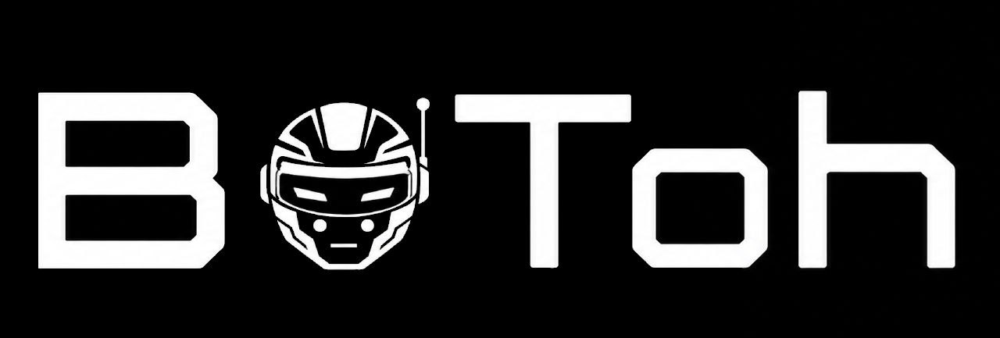
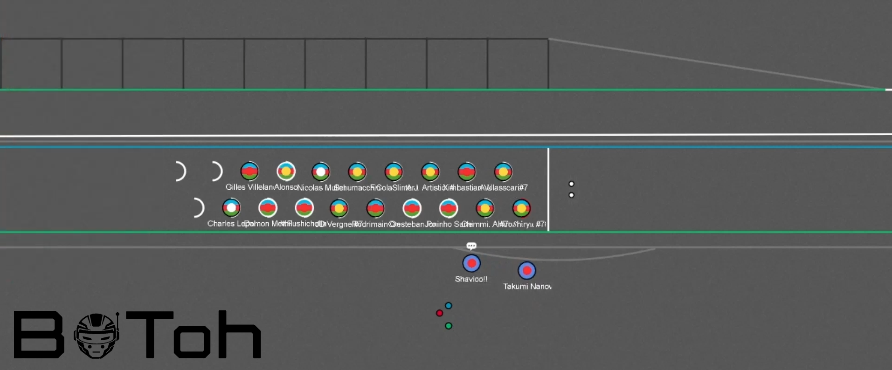

# Botoh - Advanced Haxball F1 Racing Bot

## What is Botoh?

Botoh is a sophisticated Haxball F1 racing bot that emerged from the Simple bot community, specifically designed to provide an immersive Formula 1 racing experience with advanced features and professional-level race management capabilities.

## Quick Overview of Main Systems

### 🏁 Core Racing Systems
- **Lap Counter**: Professional timing system with sector splits and lap tracking
- **40+ Different Maps**: Extensive circuit database with classic and newgen maps
- **Qualifications**: Separate qualifying sessions with dedicated timing and grid positions
- **Training Sessions**: Practice mode with unlimited laps and performance tracking

### 🗺️ Map Support
- **Classic Maps**: Support for traditional Haxball F1 circuits
- **Newgen Maps**: Advanced circuits with enhanced features and physics
- **Custom Maps**: Easy integration of user-created circuits

### 🏎️ Advanced Racing Features
- **Tire System**: Multiple tire compounds (Soft, Medium, Hard, Wet, Inter) with realistic wear
- **Pit Stops**: Complete pit lane management with realistic stop times and strategy
- **Safety Cars**: Full safety car deployment and management system
- **Flag System**: Complete race flag system (Yellow, Red, Blue, Black flags)
- **Weather System**: Dynamic weather conditions affecting grip and racing

### ⚡ Performance Systems
- **ERS (Energy Recovery System)**: Overtake boost system with strategic management
- **Fuel System**: Fuel management with consumption and strategy elements
- **Scuderia Teams**: Multiple team system with team-based features and management

### AND MORE!!!!!!!!

## Getting Started

### For Room Hosts
1. Clone the repository
2. Install dependencies with `npm install`
3. Configure `roomconfig.json` with your settings, especially the token where you can get on this link: https://www.haxball.com/rs/api/getheadlesstoken
4. Use `cd Botoh` then `cd src`
5. Use `npm build:league` or `npm build:pub`
6. Use `npx ts-node index.ts --league` or `npx ts-node index.ts --pub` to start the bot

## Botoh History

### Phase 1: Simple Bot Fork
- Initially created as a fork by Bracchio and Ximb from the Simple bot framework by thenorthstar
- Developed to meet the specific needs of the FTOH league
- Focused on basic F1 racing mechanics with gradual improvements

### Phase 2: Wild's Bot Integration
- At a critical moment, Ximb gained full access and editing rights to Wild's F1 bot, used in Haxbula
- Ximb became the main developer of the championship, bringing new technical capabilities
- Botoh was migrated to this advanced model, now using TypeScript for better type safety
- The original bot was moved to the 'OldBots' folder as legacy

### Phase 3: Haxball.js Migration
- After several months of development and usage, another major transformation occurred
- Migrated from pure Headless Host to Haxball.js for better integration and performance
- This change brought enhanced stability and new possibilities for bot features

## Complete Documentation

### 🏁 Racing Systems Documentation

#### Lap Counter System
- **Sector Timing**: Automatic sector split detection and timing
- **Lap Validation**: Complete lap validation with cut detection
- **Best Lap Tracking**: Automatic best lap recording and display
- **Position Management**: Real-time position tracking and updates

#### Qualification System
- **Q1, Q2, Q3 Sessions**: Multi-session qualification format
- **Grid Position Assignment**: Automatic grid position based on qualification times
- **Knockout System**: Elimination format for qualification sessions
- **Tire Compound Rules**: Specific tire requirements for qualification

#### Training Mode
- **Unlimited Laps**: Practice sessions with no lap limits
- **Performance Analysis**: Lap comparison and improvement tracking
- **Tire Testing**: Test different tire compounds in practice
- **Setup Testing**: Test different car setups and configurations

### 🗺️ Map System Documentation

#### Classic Maps Support
- **Traditional Circuits**: Support for original Haxball F1 maps
- **Physics Compatibility**: Optimized physics for classic map layouts
- **Record Keeping**: Best lap records for classic circuits
- **Map Validation**: Automatic validation of classic map integrity

#### Newgen Maps Support
- **Advanced Features**: Support for enhanced map features
- **Custom Physics**: Physics optimization for newgen circuits
- **Dynamic Elements**: Support for dynamic map elements
- **Enhanced Graphics**: Improved visual elements for newgen maps

#### Custom Map Integration
- **Easy Upload**: Simple custom map upload system
- **Map Validation**: Automatic validation of custom maps
- **Performance Testing**: Performance testing for custom circuits
- **Community Sharing**: Share custom maps with the community

### 🏎️ Advanced Racing Features Documentation

#### Tire System
- **Tire Compounds**: 
  - Soft: Maximum grip, fastest degradation
  - Medium: Balanced grip and durability
  - Hard: Maximum durability, reduced grip
  - Intermediate: Wet weather with light rain
  - Wet: Heavy rain conditions
- **Tire Wear**: Realistic degradation based on usage, weather, and driving style
- **Tire Strategy**: Strategic tire selection for different conditions
- **Pit Stop Integration**: Seamless tire changes during pit stops

#### Pit Stop System
- **Realistic Stop Times**: Accurate pit stop duration simulation
- **Tire Change**: Complete tire compound changing system
- **Fuel Management**: Fuel refueling during pit stops
- **Damage Repair**: Car damage repair system
- **Strategy Planning**: Strategic pit stop planning and execution

#### Safety Car System
- **Automatic Deployment**: Safety car deployment for incidents
- **Formation Laps**: Proper safety car formation procedures
- **Race Restart**: Safe race restart procedures
- **Overtake Rules**: Safety car overtake regulations
- **Lap Recovery**: Lap recovery during safety car periods

#### Flag System
- **Yellow Flag**: Warning for track incidents
- **Red Flag**: Race stoppage for serious incidents
- **Blue Flag**: Overtake warning for lapped cars
- **Black Flag**: Penalty flag for rule violations
- **Green Flag**: Race start and clear track indication
- **Checkered Flag**: Race completion flag

#### Weather System
- **Dynamic Weather**: Real-time weather changes during races
- **Rain Effects**: Rain intensity affecting grip and visibility
- **Weather Forecast**: Weather prediction for race planning
- **Tire Impact**: Weather effects on tire performance
- **Strategy Adaptation**: Strategy adjustments for weather conditions

### ⚡ Performance Systems Documentation

#### ERS (Energy Recovery System)
- **Energy Recovery**: Energy recovery during braking and coasting
- **Overtake Mode**: ERS boost for overtaking maneuvers
- **Energy Management**: Strategic energy usage planning
- **Deployment Zones**: ERS deployment zones on circuits
- **Charging System**: ERS charging during race

#### Fuel System
- **Fuel Consumption**: Realistic fuel usage simulation
- **Fuel Strategy**: Strategic fuel planning for races
- **Refueling**: Pit stop fuel management
- **Fuel Efficiency**: Fuel efficiency optimization
- **Range Calculation**: Race range and fuel calculations

#### Scuderia Team System
- **Team Management**: Complete team management system
- **Driver Assignments**: Team driver assignments and contracts
- **Team Strategy**: Team-based race strategies
- **Resource Management**: Team resource allocation
- **Competition**: Inter-team competition and rankings

### 🛡️ Player Management Systems

#### AFK Detection System
- **Standard AFK**: Kick AFK players after 30 seconds of inactivity
- **Championship AFK**: Advanced AFK system for competitive sessions
  - VSC deployment after 2 seconds of inactivity
  - Automatic announcement of AFK players
  - Safety car deployment if player leaves during VSC (once per race)
- **Configurable Timeouts**: Customizable AFK detection times

#### Camera System
- **Spectator Camera**: Active player following for spectators
- **Position-Based Tracking**: Camera follows players based on race position
- **ID-Based Tracking**: Camera follows specific player by ID
- **Auto-Switch**: Automatic camera switching between leaders
- **Manual Control**: Spectator-controlled camera selection

#### Avatar Update System
- **Optimized Updates**: Efficient avatar state management
- **Real-time Sync**: Instant avatar synchronization
- **Performance Optimized**: Minimal impact on game performance
- **Custom Avatars**: Support for custom player avatars
- **State Management**: Comprehensive avatar state tracking

#### PlayerList & PlayerObject System
- **State Storage**: Ready-to-use player state management
- **Persistent Data**: Player data persistence across sessions
- **Flexible Structure**: Adaptable to various game modes
- **Performance Tracking**: Player performance metrics storage
- **Multi-Use Storage**: Versatile data storage for different features

### 💬 Communication Systems

#### Multi-Language Chat System
- **Componentized Design**: Modular and reusable chat components
- **Multi-Language Support**: Support for multiple languages
- **Template System**: Message templates for easy localization
- **Dynamic Translation**: Real-time message translation
- **Customizable Messages**: Configurable chat messages per language

#### Mute Mode System
- **Admin-Only Chat**: Mute mode where only admins can speak
- **Global Mute**: Room-wide chat restriction
- **Selective Mute**: Individual player muting options
- **Scheduled Muting**: Time-based mute activation
- **Emergency Mute**: Instant chat shutdown for emergencies

### 🏁 Race Management Systems

#### Public Game Flow System
- **Automatic Session Flow**: Complete public game session management
- **Podium Ceremony**: Post-race podium celebration
- **Map Voting**: Democratic next map selection
- **Session Sequence**: Practice → Qualification → Rest → Race
- **Smooth Transitions**: Seamless session transitions

#### Ghost Mode System
- **Qualification Ghosting**: Ghost mode for qualification sessions
- **Training Ghosting**: Collision-free practice sessions
- **Selective Ghosting**: Ghost mode for specific players
- **Performance Impact**: Minimal performance overhead
- **Configurable Activation**: Admin-controlled ghost mode

#### Cut Detection System
- **Track Boundary Detection**: Automatic cut detection system
- **Penalty Application**: Automatic penalty for track cuts
- **Log Generation**: Detailed cut detection logs
- **Visual Feedback**: Clear indication of cut violations
- **Configurable Penalties**: Customizable penalty severity

#### DRS (Drag Reduction System)
- **Activation Zones**: Designated DRS zones on tracks
- **Speed Boost**: Automatic speed increase in DRS zones
- **Usage Tracking**: DRS usage monitoring
- **Strategic Element**: Tactical DRS deployment
- **Zone Management**: Easy DRS zone configuration

#### Safety Car & VSC System
- **Realistic Deployment**: Professional safety car procedures
- **Speed Reduction**: Automatic speed limiting during VSC
- **Formation Laps**: Proper safety car formation
- **Race Restart**: Safe race restart procedures
- **Incident Response**: Automatic deployment for incidents

#### Battle Royale Mode
- **Elimination System**: Last player eliminated each lap
- **Progressive Elimination**: Continuous player elimination
- **Final Winner**: Last remaining player wins
- **Exciting Gameplay**: High-intensity racing experience
- **Configurable Rules**: Customizable elimination parameters

#### Sandbag Mode
- **Leader Penalty**: First place player speed reduction
- **Chaos Creation**: Intentional race disruption
- **Balance Mechanic**: Prevents runaway leaders
- **Dynamic Difficulty**: Automatic difficulty adjustment
- **Entertainment Value**: Exciting race scenarios

### ⚙️ Technical Systems

#### Discord Integration System
- **Automatic Logs**: Ready-to-send Discord logs
- **Session Results**: Race result transmission
- **Performance Data**: Detailed performance metrics
- **Real-time Updates**: Live Discord notifications
- **Custom Webhooks**: Configurable Discord integration

#### IP Ban System
- **IP-Based Banning**: Ban players by IP address
- **Persistent Bans**: Ban persistence across sessions
- **Ban Management**: Comprehensive ban administration
- **Ban Appeals**: Ban appeal system integration
- **Security Features**: Advanced ban protection

#### Scuderia R&D System
- **Research Development**: Team research and development
- **Performance Factors**: Multiple factors affecting car performance
- **Upgrade System**: Car upgrade mechanics
- **Team Progression**: Team advancement system
- **Competitive Balance**: Balanced research mechanics

#### Bridge & Tunnel System
- **Special Track Elements**: Support for bridges and tunnels
- **Physics Integration**: Proper physics for special elements
- **Visual Effects**: Enhanced visual representation
- **Track Complexity**: Increased track design possibilities
- **Suzuka Integration**: Special support for Suzuka-style tracks

### 🏎️ Advanced Racing Features

#### ERS Boost System
- **Button Activation**: ERS boost on button press
- **Battery Consumption**: Battery usage during boost
- **Performance Gain**: Speed increase during ERS activation
- **Strategic Usage**: Tactical ERS deployment
- **Battery Management**: Battery charge and discharge system

#### Fuel System
- **Weight-Performance**: Less fuel = faster car
- **Pit Stop Refueling**: Refuel during pit stops with button press
- **Fuel Strategy**: Strategic fuel management
- **Consumption Tracking**: Real-time fuel usage monitoring
- **Performance Impact**: Speed based on fuel levels

#### Advanced Tire System
- **Speed Variations**: Different speeds per tire compound
- **Durability Factors**: Variable tire lifespan
- **Weather Impact**: Weather effects on tire performance
- **Strategic Selection**: Tactical tire compound choice
- **Performance Balance**: Balanced tire characteristics

#### Advanced Weather System
- **Natural Weather**: Dynamic weather generation
- **Pre-set Conditions**: Configurable weather scenarios
- **Graph Generation**: Weather visualization charts
- **Sector Weather**: Different weather per track sector
- **Tire Effects**: Weather impact on tire sliding and grip

#### Slipstream System
- **Draft Effect**: Realistic slipstream physics
- **Speed Boost**: Speed increase behind other cars
- **Strategic Overtaking**: Tactical slipstream usage
- **Distance Calculation**: Precise slipstream distance tracking
- **Performance Impact**: Significant speed advantage

#### Advanced Pitlane System
- **Speed Reduction**: Pitlane speed limiting
- **Tire Change Systems**: Two realistic tire change methods
  - **Reaction System**: Time-based tire changes
  - **Random System**: Chance-based tire change duration
- **Optional Pit Stops**: Admin-configurable mandatory pit stops
- **Pit Strategy**: Strategic pit stop planning

### 🎮 Commands Documentation

#### Basic Commands
- `!admin [PASSWORD]` - Gain admin privileges with the correct password
- `!commands` - View all available commands in the room
- `!help` - Receive help information and command usage
- `!tips` - Get tips about the host and room features
- `!discord` - Receive the Discord server link
- `!bb` - Leave the room (bye bye)

#### Session Management Commands
- `!qmode` - Activate qualification mode
- `!tmode` - Activate training/practice mode
- `!qtime [MINUTES]` - Set qualification time duration
- `!brmode` - Activate Battle Royale mode
- `!laps [NUMBER]` - Set the number of laps for the race
- `!clear_time` - Clear qualification and training times
- `!presentation` - Enter presentation lap mode
- `!imode` - Activate Indy mode (specific racing format)

#### Circuit & Map Commands
- `!circuit [ID]` - Set the current circuit/map by ID
- `!maps` - View all available maps with their IDs
- `!record` - View the record time for the current circuit
- `!vote [NUMBER]` - Vote for a map in public host rooms

#### Player Information Commands
- `!times` - View current qualification or training times
- `!positions` - View current race positions
- `!everyone_laps` - Show all players' lap times in chat
- `!players_quantity` - Check how many players are in the room
- `!lang [LANGUAGE]` - Set your personal language preference

#### Car & Performance Commands
- `!speed [on/off]` - Toggle speed log display on avatar
- `!tyres [COMPOUND]` - Change tire compound (in pit or at 00:00)
- `!fuel [on/off]` - Enable/disable fuel system
- `!ghost [on/off]` - Enable/disable ghost mode (players pass through each other)
- `!ers` - View ERS status and available energy
- `!explain_tyres` - Get explanation about tire system
- `!explain_server` - Get explanation about server features
- `!explain_ers` - Get explanation about ERS system

#### Safety & Regulation Commands
- `!vsc [on/off]` - Enable/disable Virtual Safety Car
- `!sc [on/off]` - Enable/disable Safety Car
- `!safety` - Toggle competitive safety car and AFK mode
- `!flag [COLOR]` - Activate a specific flag
- `!clear_Debris` - Remove debris from the track

#### Race Control Commands
- `!toggle_rr` - Toggle whether restart (!rr) is allowed
- `!rr` - Reset your position (useful for qualifications and training)
- `!set_rr` - Set restart position based on current position
- `!sandbag` - Activate sandbag mode (leader speed reduction)
- `!min_pit [NUMBER]` - Set minimum pit stops required to avoid DSQ

#### Admin & Room Management Commands
- `!clear_bans` - Remove all bans from the room
- `!mute [on/off]` - Mute/unmute the chat
- `!set_max_players [NUMBER]` - Set maximum player limit
- `!enable [SYSTEM] [on/off]` - Enable/disable various systems
- `!adjust [SYSTEM] [VALUE]` - Adjust numbers for various systems
- `!constants [SYSTEM] [VALUE]` - Change constants for various systems
- `!config [TYPE]` - Set configuration type for different communities

#### Weather System Commands
- `!rain [on/off/CHANCE]` - Start rain, stop rain, or set rain probability
- `!set_weather_id [ID]` - Set specific weather type to be used

#### Team & Scuderia Commands
- `!team [NAME]` - Set a team for yourself
- `!view_teams` - View all teams and their members
- `!upgrade [TEAM]` - Upgrade a team's performance
- `!nerf [TEAM]` - Apply nerf to a specific team

#### Pit & Tire Management Commands
- `!pit [old/new]` - Set pit system (old reaction-based or new random-based)
- `!manage_tyres [on/off]` - Enable/disable tire wear management system

#### Camera & Testing Commands
- `!camera_properties` - Change camera properties for testing
- `!camera_id [PLAYER_ID]` - Set camera to follow specific player ID
- `!camera_position [POSITION]` - Set camera to follow specific race position

#### Utility Commands
- `!afk` - Set yourself as AFK (Away From Keyboard)
- `!volver` - Come back from AFK status
- `!tp [X] [Y]` - Teleport to specific coordinates
- `!clear [TYPE]` - Clear specific times or data

#### Advanced Commands
- `!setup [parameter] [value]` - Adjust car setup parameters
- `!strategy [plan]` - Set race strategy
- `!pit [lap] [compound]` - Plan pit stop strategy
- `!drs` - Check DRS availability and zones
- `!sector` - Show sector times and comparisons
- `!telemetry` - Display detailed telemetry data
- `!move_to_box [PLAYER]` - Move specific player to box/pit lane

## Community and Support

### Development
- **Open Source**: MIT License for community contributions
- **Modular Structure**: Easy feature additions and modifications
- **Documentation**: Comprehensive guides and API references
- **Active Development**: Continuous improvements and updates

### Support Channels
- **Discord Community**: Active discussion and support
- **Issue Tracking**: GitHub-based bug reports and feature requests
- **Regular Updates**: Scheduled improvements and new features

## License

This project is licensed under the MIT License - see [LICENSE](Botoh/Doc/LICENSE) for details.
